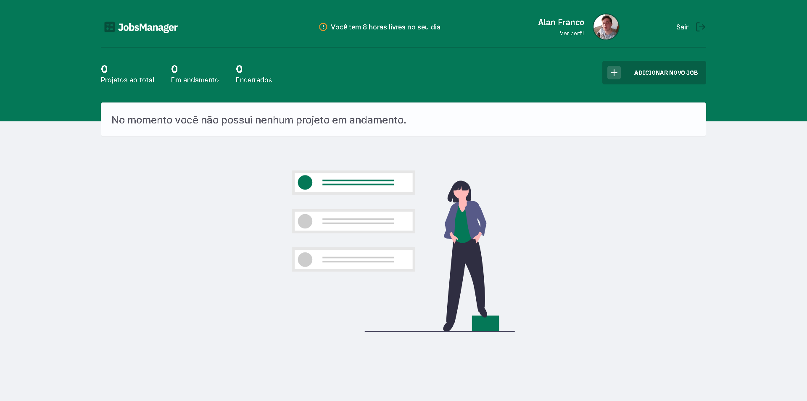

  

O JobsManager é uma plataforma de estimativa de cálculo para projetos freelancer, onde é possível cadastrar e excluir jobs (projetos), obtendo uma estimativa de custo de cada job. Além disso, é possível traçar o valor da hora da pessoa que estará usando o sistema

 

<!-- <h1 align="center">
    
</h1> -->

 

  
  

 

## 🚀 Tecnologias
Esse projeto foi desenvolvido com as seguintes tecnologias:

* [React](https://reactjs.org/) - A JavaScript library for building user interfaces
* [Next.js](https://nextjs.org/) - The React Framework
for Production
* [Typescript](https://www.typescriptlang.org/) - Typed JavaScript at Any Scale.
* [Node.js](https://nodejs.org/en/) - A JavaScript runtime built on Chrome's V8 JavaScript engine.
* [Express.js](http://expressjs.com/) - Fast, unopinionated, minimalist web framework for Node.js
* [PostgreSQL](https://www.postgresql.org/) - The World's Most Advanced Open Source Relational Database

## 🎉 Funcionalidades
* PWA - Progressive Web App ✅
* Fluxo de Autenticação completo com JWT, Confirmação por E-mail e Recuperação de senha. ✅
* Tradução 🇺🇸 e 🇧🇷 com i18n integrado no NextJS e feito 60% da tradução ✅

## 🤔 Como contribuir

- Faça um fork desse repositório;
- Cria uma branch com a sua feature: `git checkout -b minha-feature`;
- Faça commit das suas alterações: `git commit -m 'feat: Minha nova feature'`;
- Faça push para a sua branch: `git push origin minha-feature`.

Depois que o merge da sua pull request for feito, você pode deletar a sua branch.

---

Feito com 💚 by AlanM Franco  [Visite meu Portfolio!](https://alnmaurofranco.github.io/)